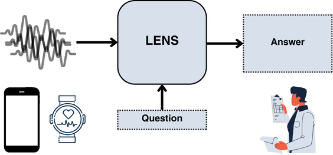

# LENS: LLM-Enabled Narrative Synthesis for Mental Health by Aligning Multimodal Sensing with Language Models

Wenxuan Xu\*<sup>1</sup>, Arvind Pillai\*<sup>1</sup>, Subigya Nepal<sup>2</sup>, Amanda C Collins<sup>3</sup>, Daniel M Mackin<sup>1</sup>, Michael V Heinz<sup>1</sup>, Tess Z Griffin<sup>1</sup>, Nicholas C Jacobson<sup>1</sup>, Andrew Campbell<sup>1</sup>

<sup>1</sup> Dartmouth College &nbsp; <sup>2</sup> University of Virginia &nbsp; <sup>3</sup> Massachusetts General Hospital, Harvard Medical School

\*Equal contribution

:page_with_curl: Read the paper [here](https://arxiv.org/abs/2512.23025)

<p align="center">
  
</p>

LENS turns raw wearable/phone sensor streams (heart rate, accelerometer-derived
zero-crossing rate, steps, stress, GPS, phone unlock, sleep, conversation) plus
Ecological Momentary Assessment (EMA) self-reports into clinically grounded
natural-language summaries of a person's recent depression / anxiety symptom
state. It has two parts:

1. **A data-synthesis pipeline** — converts EMA responses into item-level and
   summary-level template narratives, refines them with an LLM (Qwen2.5-14B),
   and filters them with a multi-agent LLM-as-a-judge. Produces ~102k item-level
   QA pairs and ~51k summary-level narratives, each paired with the corresponding
   raw sensor windows.
2. **A patch-based time-series encoder + LLM** — a lightweight MLP encoder maps
   each sensor stream into the LLM's embedding space; the model is trained in two
   stages (encoder alignment, then supervised fine-tuning on the EMA-derived
   datasets), built on [ChatTS-Training](https://github.com/xiezhe-24/ChatTS-Training).

## Abstract

> Multimodal health sensing offers rich behavioral signals for assessing mental
> health, yet translating these numerical time-series measurements into natural
> language remains challenging. Current LLMs cannot natively ingest long-duration
> sensor streams, and paired sensor-text datasets are scarce. To address these
> challenges, we introduce LENS, a framework that aligns multimodal sensing data
> with language models to generate clinically grounded mental-health narratives.
> LENS first constructs a large-scale dataset by transforming Ecological
> Momentary Assessment (EMA) responses related to depression and anxiety symptoms
> into natural-language descriptions, yielding over 100,000 sensor-text QA pairs
> from 258 participants. To enable native time-series integration, we train a
> patch-level encoder that projects raw sensor signals directly into an LLM's
> representation space. Our results show that LENS outperforms strong baselines
> on standard NLP metrics and task-specific measures of symptom-severity
> accuracy. A user study with 13 mental-health professionals further indicates
> that LENS-produced narratives are comprehensive and clinically meaningful.
> Ultimately, our approach advances LLMs as interfaces for health sensing,
> providing a scalable path toward models that can reason over raw behavioral
> signals and support downstream clinical decision-making.

## ⚠️ Data availability

The passive-sensing and EMA data underlying the paper were collected under an
NIH/NIMH award (R01MH123482-01) and are governed by IRB and funder data-use
restrictions — **they are not distributed in this repository.** The de-identified
study data is available through the
**[NIMH Data Archive (NDA), Collection 3634](https://nda.nih.gov/edit_collection.html?id=3634)**
(DOI: [10.15154/nt2p-pb72](https://doi.org/10.15154/nt2p-pb72));
researchers must submit a Data Use Certification (DUC) to request access.

To keep the code runnable in the meantime, this repo ships **only a deterministic
synthetic-data generator** — `data/fake/generate.py` (pinned seed). Run
`make fake-data` to materialize a complete, schema-faithful fake dataset under
`data/fake/` and `examples/` (raw sensor CSVs at the paper's sampling rates,
synthetic EMA, the rule → rewrite → judge intermediates, and the training-ready
jsonl). None of that generated data is committed — regenerate it any time. Every
script also accepts a `--data-root` so the same code runs against the private
study data. See `data/fake/README.md`.

## Repository layout

```
lens/feature_engineering/  raw sensors + EMA  ->  windowed feature rows (feature_rows.csv)
lens/data_pipeline/        EMA -> rule templates -> LLM enrichment -> multi-judge QC -> training jsonl
lens/training/             two-stage SFT launch scripts + configs (runs on the ChatTS-Training submodule)
lens/eval/                 inference + ROUGE/BLEU/METEOR/BERTScore + LLM-as-judge (coverage / presence / severity)
lens/baselines/            ts_text (few-shot), ts_image (Qwen2.5-VL), ts_text_ft (text-only fine-tune via LLaMA-Factory)
configs/                   YAML configs (no secrets; API keys read from env)
data/fake/generate.py      deterministic synthetic-data generator (run `make fake-data`)
ChatTS-Training/           git submodule — the training stack (a LLaMA-Factory fork w/ the `chatts` template + patch-based TS encoder), pinned at cf2139a8
LLaMA-Factory/             git submodule — upstream LLaMA-Factory, used by the TS-Text-FT text-only baseline
```

## Quickstart

```bash
git clone --recursive https://github.com/Wen-xuan-Xu/LENS.git
cd LENS
pip install -e ".[pipeline,eval,dev]"

# materialize the synthetic data, then run the whole thing end-to-end
make fake-data
make smoke-test
```

Cloned without `--recursive`? `git submodule update --init --recursive`. The
submodules (`ChatTS-Training/`, `LLaMA-Factory/`) are only needed for training /
the TS-Text-FT baseline — the smoke test, pipeline, and eval-metrics code don't
need them.

Pipeline stages individually:

```bash
make smoke-test-feature    # raw sensors -> feature_rows.csv -> filtered_feature_rows.csv
make smoke-test-pipeline   # EMA -> templates -> (mock) LLM enrichment -> dataset_build -> jsonl
make smoke-test-eval       # (mock) inference -> NLP metrics
```

### Sensor sampling rates (used by the synthetic data, matching the paper)

After preprocessing, all streams are standardized over a 4-hour pre-EMA window:
heart rate every 10 s (length 1440), pseudoactigraphy = ZCR count × energy every
30 s (480), steps every 60 s (240), stress every 60 s (240), GPS
longitude/latitude every 10 min (24 each), phone unlock every 60 s (240); sleep
duration (h) and conversation length (s) are stored as scalars per window.

## Training

The training stack is [ChatTS-Training](https://github.com/xiezhe-24/ChatTS-Training)
(a [LLaMA-Factory](https://github.com/hiyouga/LLaMA-Factory) fork with the
`chatts` chat template + the patch-based time-series encoder), included as a git
submodule at `./ChatTS-Training` and pinned at commit `cf2139a8`. The TS-Text-FT
text-only baseline uses upstream LLaMA-Factory, also a submodule (`./LLaMA-Factory`).
The LENS-specific launch scripts, YAML configs, and DeepSpeed configs live in
`lens/training/` and `configs/training/`. See `lens/training/README.md` and
`lens/baselines/ts_text_ft/README.md`.

- **Stage 1 (encoder alignment):** `align_256 : narrative : qa = 0.8 : 0.1 : 0.1`,
  `cutoff_len 4000`.
- **Stage 2 (supervised fine-tuning):** `narrative : qa : ift : align_random = 0.3 : 0.3 : 0.2 : 0.2`,
  `cutoff_len 4000`, full-parameter fine-tuning of the Qwen2.5-14B backbone +
  encoder. (`cutoff_len 20000` for the TS-Text-FT text-only baseline.)

`align_256` / `align_random` / `ift` are not LENS-generated — they are pulled from
the Hugging Face Hub at
[`ChatTSRepo/ChatTS-Training-Dataset`](https://huggingface.co/datasets/ChatTSRepo/ChatTS-Training-Dataset)
(see `lens/training/dataset_info.template.json`).

## Citation

```bibtex
@article{xu2025lens,
  title={LENS: LLM-Enabled Narrative Synthesis for Mental Health by Aligning Multimodal Sensing with Language Models},
  author={Xu, Wenxuan and Pillai, Arvind and Nepal, Subigya and Collins, Amanda C and Mackin, Daniel M and Heinz, Michael V and Griffin, Tess Z and Jacobson, Nicholas C and Campbell, Andrew},
  journal={arXiv preprint arXiv:2512.23025},
  year={2025}
}
```

If you use the training stack or the alignment data, please also cite
**ChatTS** ([Xie et al., 2025](https://github.com/NetmanAIOps/ChatTS)),
**[ChatTS-Training](https://github.com/xiezhe-24/ChatTS-Training)**, and
**[LLaMA-Factory](https://github.com/hiyouga/LLaMA-Factory)**.

## License

Apache-2.0 (see `LICENSE` and `NOTICE`).
